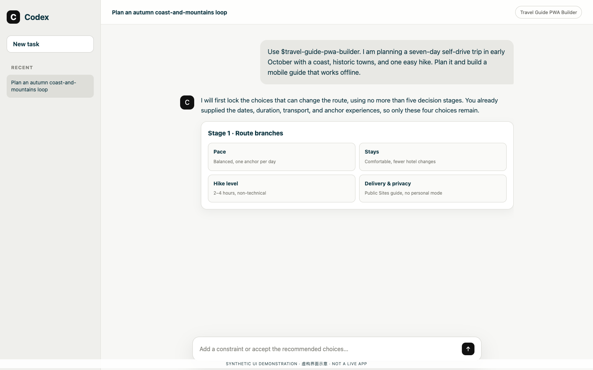
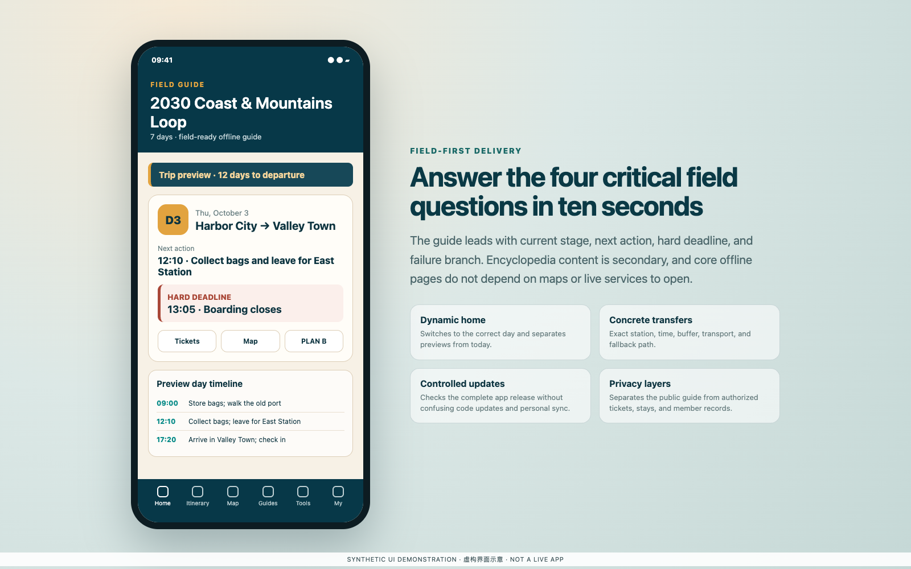
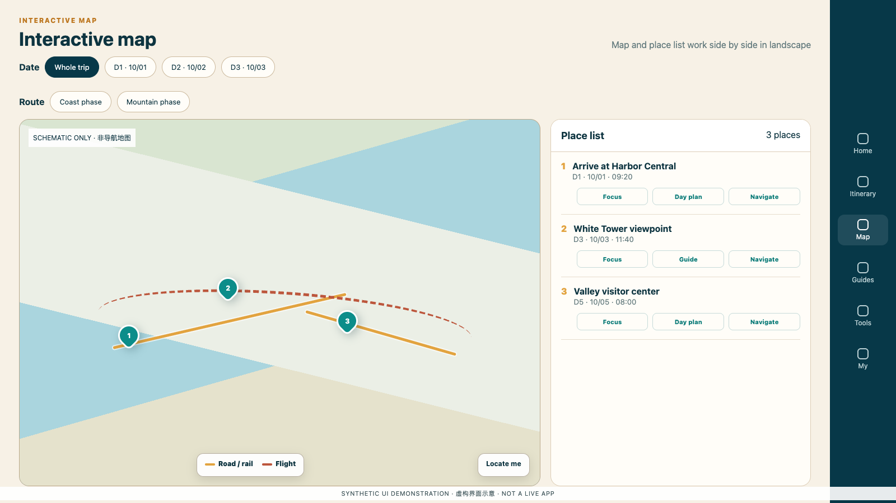
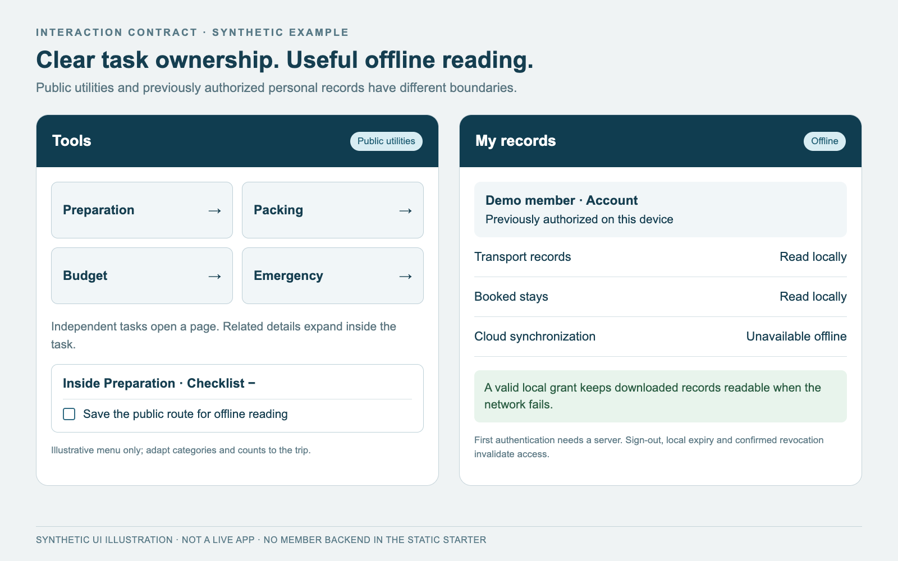
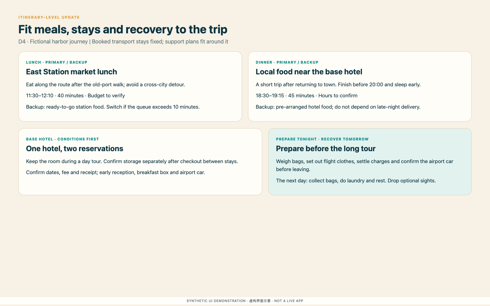

# Travel Guide PWA Builder

Current version: **2.5.0**

Turn a one-line trip idea, a substantially fixed itinerary, or an existing guide into a destination-themed, mobile-first travel PWA for field execution, offline reading, and controlled updates. The skill supports low-interaction planning, booked-itinerary delivery, existing-site iteration, and publishing through ChatGPT Sites.

[中文](README.zh-CN.md) · [Bilingual overview](README.md) · [Changelog](CHANGELOG.md)

## Start with one sentence

Travelers do not need an existing guide interface or a completed day-by-day plan. The entry point is a Codex conversation, for example:

> Use `$travel-guide-pwa-builder`. I am planning a seven-day self-drive trip in early October with a coast, historic towns, and one easy hike. Plan it and build a mobile guide that works offline.

The images below are synthetic UI illustrations rendered from self-contained HTML, not screenshots of Codex or a deployed guide. See [image provenance](docs/SCREENSHOTS.md).



Planning mode uses at most five compact decision stages and skips facts already supplied. It verifies only plan-invalidating facts before delivering a usable first version.

## Three working modes

| Mode | Typical input | Behavior |
|---|---|---|
| Planning | “Plan an autumn seven-day road trip.” | Resolve route-changing branches in no more than five stages, run bounded research, normalize the route, and build the first guide. |
| Execution | “These dates, flights, and hotels are confirmed.” | Lock user-supplied facts and add daily timelines, concrete transfers, hard deadlines, and fallback branches. |
| Update | “The hotel changed and day three starts two hours later.” | Apply the canonical delta, remove retired facts throughout the product, and rebuild the complete release. |

An incremental change describes the source-data and code delta. The PWA is still built and published as one compatible release so that old pages, styles, and caches are not mixed with new ones.

## Minimal planning interaction

The skill asks only branch-changing questions and groups related decisions:

1. dates, duration, origin, party size, and self-drive or public-transport constraints;
2. must-see experiences, exclusions, and preferred pace;
3. budget, stay standard, and tolerance for long transfers;
4. mobility, climate, documents, food, or health constraints that affect the route;
5. local delivery or ChatGPT Sites, plus whether authenticated personalization is required.

Safe defaults remain visible and editable. The first research pass normally covers only entry or driving restrictions, seasonal closure risk, the longest transfer, realistic time between overnight bases, and a small number of budget anchors.

## Field-first deliverables

- a dynamic home showing current stage, next action, next transfer, and a real hard deadline;
- day pages with timelines, concrete transport, collapsible detail, and delay or weather Plan B;
- an interactive route map with date/city filters, ordered places, list fallback, and landscape operation;
- embedded guide sections for sights, transport, and stays/food with exact return positions;
- tools and settings for checklists, budget, emergency contacts, map sources, offline state, and full-release updates;
- white-background, black-text print views for the itinerary, preparation checklist, and packing checklist;
- optional separation between public guide content and private tickets, stays, equipment, and member records;
- build, privacy, offline, mobile, and release checks plus explicit items still requiring human confirmation.



## Information architecture and usage tips

- Separate immutable bookings, planning assumptions, and dynamic recheck items. Never silently change a hard fact.
- Field pages follow “deadline → transition → failure branch” and keep encyclopedia content secondary.
- Compute trip state with calendar dates. A preview is never labeled as today; flight times remain local to the ticketed airport.
- Restore filters and the exact originating item when returning from detail; guide links inside a day return to the exact schedule node.
- Derive map markers and the list from the same stable data. Use side-by-side map/list layout in landscape and a hand-friendly fixed map height in portrait.
- Prefer automatic responsive orientation. Add fullscreen/orientation controls when needed; do not rotate a live map with CSS because it breaks pointer coordinates.
- “Update app” replaces the complete page/code/offline release. “Sync data” handles only authorized personal records.
- Public screenshots and image exports omit names, booking references, prices, tickets, and private notes.



## Local environment and network dependencies

- Python 3.10 or newer for project generation, static audits, and tests;
- a modern browser for Service Worker, offline, print, orientation, safe-area, and PWA checks;
- Git only for repository and release workflows;
- existing hosted projects must follow their `package.json`, lockfile, `.openai/hosting.json`, and the current official Sites skills; this skill does not pin a framework or runtime version;
- network access is required for authoritative-source checks, dependency installation, map tiles, live weather/fares, external navigation, Sites authentication/publishing, and first private-data download or sync.

The local static starter can be generated and tested offline. Core public reading should work offline after a successful install; map tiles, live data, external navigation, and first private login are outside that guarantee.

### Without ChatGPT Sites

The skill can still deliver a local or portable public static PWA. A conceptual substitute requires static hosting, HTTPS, server functions, identity, durable database or object storage, and provider-specific cache, authorization, migration, and deployment work. **This skill currently does not implement, provide, or recommend a specific alternative hosting solution.**

## Install and invoke

```bash
git clone --branch v2.5.0 https://github.com/pengguin/travel-guide-pwa-builder.git \
  ~/.codex/skills/travel-guide-pwa-builder
```

Describe the trip after installation or explicitly invoke `$travel-guide-pwa-builder`.

Create the dependency-free local starter:

```bash
python3 scripts/create_project.py \
  --output /path/to/new-guide \
  --title "Example Coast and Mountains Loop" \
  --short-title "Coast and Mountains" \
  --start-date 2030-10-01 \
  --end-date 2030-10-07 \
  --origin "Origin City" \
  --destinations "Harbor City" "Valley Town" "Old Town" \
  --theme auto
```

The starter intentionally has no login, private upload, or cloud synchronization. Use the official Sites workflow for those capabilities after defining the public/private boundary.

## Validation

```bash
python3 -m unittest discover -s tests -v
node --test tests/*.test.cjs
python3 scripts/audit_travel_guide.py /path/to/guide --release
```

A passing static build is not physical-device acceptance. iPhone Home Screen cold start, flight mode, keyboard zoom, safe areas, system print, installed map-app links, and deployed account isolation require separate tests on the actual device and domain.

## Privacy, disclaimer, and license

This repository contains no real traveler, itinerary, ticket, booking, access code, personal equipment, database, deployment identifier, or credential. Real projects may contribute reusable methods, data contracts, and checks—not public sample data.

- English disclaimer: [DISCLAIMER.en.md](DISCLAIMER.en.md)
- English license text: [LICENSE](LICENSE)
- Unofficial Chinese license explanation: [LICENSE.zh-CN.md](LICENSE.zh-CN.md)
- Environment and deployment boundary: [references/environment-and-deployment.md](references/environment-and-deployment.md)
- Maintenance architecture and circular-dependency prevention: [references/architecture-and-maintenance.md](references/architecture-and-maintenance.md)


## 2.5.0: offline identity and consistent interactions

- **Offline reading must not depend on successful revalidation at every launch.** First authentication and private download still require authorization; subsequent valid local access distinguishes connectivity failure, session expiry, membership revocation and explicit sign-out.
- **Organize Tools and My around tasks.** Independent tools may open subpages, with related details expanding inside them. Edit tickets/stays at their collections; keep public packing entries free of personal equipment.
- **Repair shared layout contracts.** Give every header variant an explicit safe-area owner, reveal selected day chips fully, preserve the reading frame and avoid scroll compensation that displaces fixed navigation during downward pull.
- **Test actual failure scenarios.** Compare every day before/after login, short/long panels, cancelled edits, late requests and account switching; distinguish simulation from physical-device acceptance.



See [interaction architecture](references/interaction-architecture.md), [offline identity](references/offline-identity.md) and [QA/release](references/qa-and-release.md). These are reusable development and acceptance contracts; **the static starter has no new login, member backend or personal offline-grant implementation**. This release does not prescribe menu counts, Material or another visual framework, destination palettes, or changes to a reference website.

Before updating an installed skill, back it up and inspect local changes; do not clone over an existing directory. Download the ZIP and SHA-256 from the [v2.5.0 Release](https://github.com/pengguin/travel-guide-pwa-builder/releases/tag/v2.5.0), verify them, then replace only this skill folder. The GitHub tag and installed files should identify the same snapshot.

## Itinerary updates and capability boundaries

- Keep booked flights/trains immutable. Fit meals, base hotels, luggage and sleep around prioritized operator products and personal themes.
- Prefer one primary and one backup for each daily lunch/dinner. State late arrival, early checkout, breakfast and cross-reservation storage conditions; a candidate is not a booking.
- Synchronize the home, days, maps, guide dates, reminders, calendar, budget and complete offline release.
- Detect static and Sites/Vinext public output, check icons and optional SHA-256 manifests; choose a source scan explicitly.



| Capability | Included in this package | Still requires implementation/verification |
| --- | --- | --- |
| Portable static starter | Local data, date state, checklists, calendar, print entry and basic offline cache | Final itinerary, real images and actual map integration |
| Itinerary updates | Fixed-ticket, food/stay, recovery/storage and derived-view workflow | Applying the delta to the existing project |
| Release audit | Public directory, assets, icons, optional SHA-256 and heuristic leakage checks | API permissions, browser behavior and every possible private datum |
| Whole-app updates | Starter cache isolation/failure behavior and full-app architecture guidance | No starter digest repair, member backend or end-user update button |
| Documentation images | Browser-rendered bilingual fictional UI illustrations | Not current Codex screenshots, real travel maps or device acceptance evidence |

Audit examples:

```sh
python3 scripts/audit_travel_guide.py /path/to/guide --release
python3 scripts/audit_travel_guide.py /path/to/guide --release --public-dir custom/output
python3 scripts/audit_travel_guide.py /path/to/guide --release --source
python3 scripts/check_docs.py
```

`--release` scans deployed public files by default. `--source` adds a source-tree review, which may include legitimate authorized server records. Neither replaces manual privacy review or browser/device acceptance.

See the [changelog](CHANGELOG.md), [verification and packaging](docs/releases/2.5.0.md), [image provenance](docs/SCREENSHOTS.md), [contributing](CONTRIBUTING.md) and [GitHub Release](https://github.com/pengguin/travel-guide-pwa-builder/releases/tag/v2.5.0). Verify the ZIP with its SHA-256 file; the extracted skill folder is `travel-guide-pwa-builder`.
