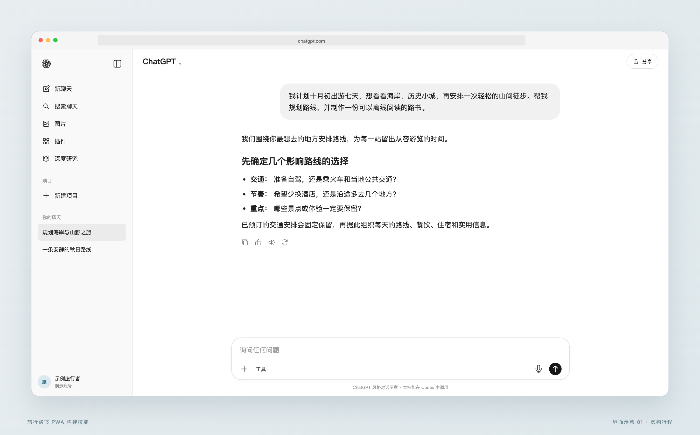
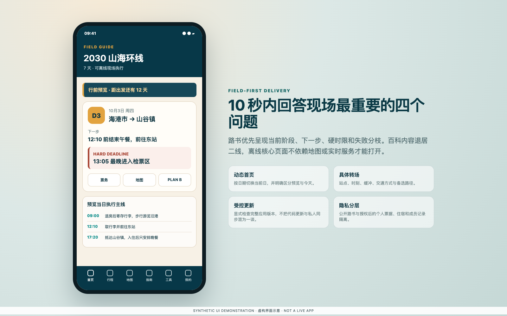
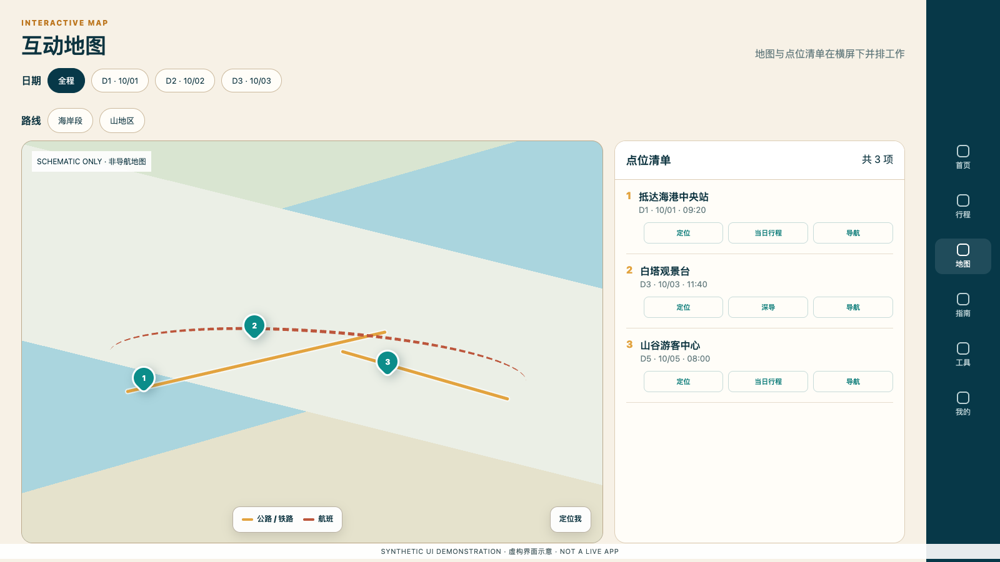
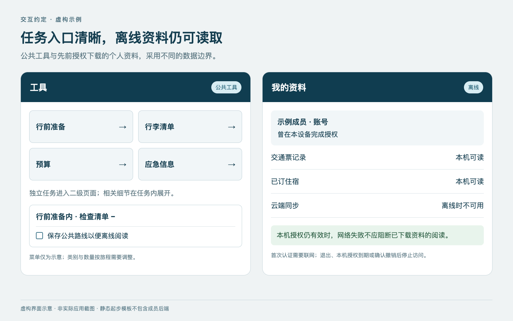
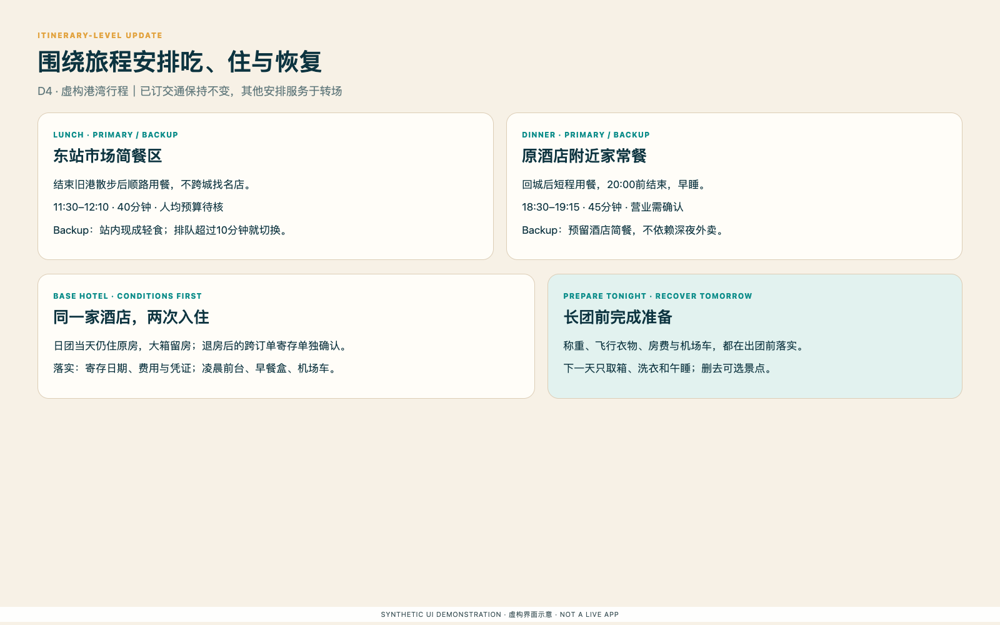

# 旅行路书 PWA 构建技能

当前版本：**2.5.0**

把一句旅行想法、已经确认的行程，或一套正在使用的路书，转成适合手机现场执行、可离线阅读、能够持续更新的旅行 PWA。技能支持低交互规划、固定行程落地、既有站点迭代，以及通过 ChatGPT Sites 发布。

[English](README.en.md) · [双语总览](README.md) · [更新记录](CHANGELOG.md)

## 从一句话开始

旅行者不需要先拥有路书界面，也不需要自己填写完整逐日计划。入口是 Codex 对话，例如：

> 使用 `$travel-guide-pwa-builder`：我计划今年十一自驾 7 天，想看海岸、古镇和一段轻徒步。请帮我规划，并制作可以离线使用的手机路书。

以下图片均为自包含 HTML 渲染的虚构界面示意，不是 Codex 或实际路书截图；详见[图片来源](docs/SCREENSHOTS.md)。



规划模式最多进行五个紧凑的决策阶段；已经回答的内容自动跳过。技能先核查可能推翻路线的关键事实，再交付可用初版，不会在生成路书之前要求用户写出完整日程。

## 三种工作模式

| 模式 | 典型输入 | 处理方式 |
|---|---|---|
| 规划模式 | “十一去青甘大环线自驾，帮我规划。” | 在不超过五个决策阶段内确定关键分枝，进行有限联网核查，生成结构化路线与初版路书。 |
| 执行模式 | “日期、机票和酒店已经确认，按这些材料制作路书。” | 锁定用户提供的硬事实，补齐每天的时间线、具体转场、硬时限和备用方案。 |
| 更新模式 | “酒店换了，第三天延后两小时。” | 将新信息写入规范化数据，清理全站旧口径，重新构建并发布完整版本。 |

“增量修改”描述的是数据与代码的变更范围；最终 PWA 仍作为一个完整、相互兼容的发布包构建，避免新旧页面、样式和离线缓存混用。

## 规划模式的最小交互

技能只询问真正会改变路线的分枝，并把相关问题合并：

1. 时间、时长、出发地、人数和自驾或公共交通约束；
2. 必去、不去和旅行节奏；
3. 预算、住宿标准和对长途转场的容忍度；
4. 行动能力、气候、证件、饮食或健康约束；
5. 本地交付或 ChatGPT Sites，以及是否启用需要登录的个性化模式。

安全默认值会明确写入初版，用户可以之后再调整。首次联网核查通常只覆盖入境或自驾限制、季节关闭、最长转场、住宿基地之间的现实耗时和少量预算锚点。

## 现场优先的交付物

- 动态首页：当前阶段、下一步、下一段交通和真正的硬时限；
- 逐日执行页：时间线、具体转场、折叠详情、天气或延误备用方案；
- 互动地图：按城市和日期筛选、路线顺序、点位清单和横屏操作；
- 行程指南：景点、交通、食宿等内嵌栏目和精确返回位置；
- 工具与设置：清单、预算、应急联系、地图来源、离线与整包更新；
- 白底黑字的简化行程、准备清单和行李清单打印；
- 可选的公开路书与私人票务、住宿、装备、成员资料分层；
- 构建、隐私、离线、移动端和发布检查，以及剩余人工确认项。



## 信息架构与使用技巧

- 明确区分“已出票或不可改”“规划假设”“动态待复核”；技能不会静默改动硬事实。
- 现场页面遵循“硬时限 → 转场 → 失败分枝”，不会继续堆叠百科型内容。
- 日期状态按日历日期计算；预览日不能冒充今天，跨时区航班时刻仍使用当地票面时间。
- 从列表进入详情后，返回时恢复筛选条件和原条目位置；行程中的景点入口返回具体时间节点。
- 地图标记和清单来自同一组稳定数据；横屏时地图与清单并排，竖屏保持适合手持操作的高度。
- 优先采用自动响应式横竖屏；仅在需要时增加全屏或方向控制，不使用 CSS 旋转地图画布。
- “更新应用”更新页面、代码和离线资源；“同步数据”只处理当前授权成员的私人记录。
- 公开可分享的截图和导出图不包含姓名、订单号、价格、票据或私人备注。



## 本机开发环境与网络依赖

- Python 3.10 或更高版本：运行项目初始化、静态审计和测试；
- 现代浏览器：验证 Service Worker、离线、打印、横竖屏和 PWA 行为；
- Git：仅仓库与发布工作流需要；
- 已托管项目：遵循现有 `package.json`、锁文件、`.openai/hosting.json` 和当前官方 Sites 技能，不在本技能中固定框架或运行时版本；
- 网络：官方事实核查、依赖安装、在线地图、实时天气与票价、外部导航、Sites 登录与发布、首次私人数据下载或同步需要网络。

本地静态起步项目可以离线生成和测试。核心公共路书在成功安装后应可离线阅读；地图瓦片、实时信息、外部导航和首次私人登录不属于离线保证。

### 没有 ChatGPT Sites 时

本技能仍可交付本地或便携的公开静态 PWA。概念上的替代架构需要静态托管、HTTPS、服务端函数、身份系统、持久数据库或对象存储，并重新设计缓存、权限、迁移和发布流程。**本技能目前不提供、实现或推荐具体的替代托管方案。**

## 安装与调用

```bash
git clone --branch v2.5.0 https://github.com/pengguin/travel-guide-pwa-builder.git \
  ~/.codex/skills/travel-guide-pwa-builder
```

安装后直接描述旅行需求，或显式调用 `$travel-guide-pwa-builder`。

本地无后端起步项目：

```bash
python3 scripts/create_project.py \
  --output /path/to/new-guide \
  --title "示例山海环线" \
  --short-title "山海环线" \
  --start-date 2030-10-01 \
  --end-date 2030-10-07 \
  --origin "出发城" \
  --destinations "海港城" "山谷镇" "古城" \
  --theme auto
```

这个起步项目不实现登录、私人上传或云同步；如需这些能力，应使用官方 Sites 工作流并先确定公开与私人边界。

## 验证

```bash
python3 -m unittest discover -s tests -v
node --test tests/*.test.cjs
python3 scripts/audit_travel_guide.py /path/to/guide --release
```

通过静态构建不等于通过真机验收。iPhone 主屏幕冷启动、飞行模式、键盘缩放、安全区、系统打印、地图 App 深链和已部署账号隔离，必须在相应设备和域名上分别验证。

## 隐私、免责声明与许可

本仓库不包含真实旅行者、行程、票据、订单、访问码、个人装备、数据库、部署标识或凭据。真实项目只能贡献可复用的方法、数据契约和检查项，不能直接成为公开示例。

- 中文免责声明：[DISCLAIMER.zh-CN.md](DISCLAIMER.zh-CN.md)
- 中文许可说明：[LICENSE.zh-CN.md](LICENSE.zh-CN.md)
- 标准 MIT 许可证：[LICENSE](LICENSE)
- 环境与部署边界：[references/environment-and-deployment.md](references/environment-and-deployment.md)
- 维护架构与避免循环依赖：[references/architecture-and-maintenance.md](references/architecture-and-maintenance.md)

---


## 2.5.0：离线身份与一致交互

- **离线读取不依赖每次联网成功。** 首次登录和私人资料下载仍须授权；以后用有效的本机离线授权立即读取，将断网、会话过期、成员撤销和主动退出分别处理。
- **工具与我的按任务组织。** 独立工具进入二级页，相关详情可在页内展开；票务、住宿在各自清单直接编辑，公共行李入口不混入私人装备。
- **统一修复布局约定。** 每种标题栏明确安全区归属；日期按钮完整可见，切换栏目保持阅读位置，底部导航不随页面下拉补偿而位移。
- **回归检查覆盖真实失败场景。** 核对所有日期登录前后内容、长短面板、取消编辑、迟到的请求和账号切换，区分模拟检查与真机验收。



详见[交互架构](references/interaction-architecture.md)、[离线身份](references/offline-identity.md)及[验收与发布](references/qa-and-release.md)。这些是可复用的开发与验收约定；**静态起步模板没有新增登录、成员后端或个人离线授权实现**。本版不规定按钮数量、Material 等视觉框架或目的地配色，也不改变参考网站。

更新已安装技能前，先备份并核对本机改动；不要把克隆命令用于覆盖已有目录。可从 [v2.5.0 Release](https://github.com/pengguin/travel-guide-pwa-builder/releases/tag/v2.5.0) 下载 ZIP 与 SHA-256，验证后替换该技能目录。GitHub 标签与安装文件应来自同一快照。

## 行程更新与能力边界

- 已订机票/火车保持不变；团与个人主题优先，餐饮、酒店、取箱和睡眠围绕它们调整。
- 每天午餐/晚餐各一主一备；酒店列出晚到、早退、早餐和跨订单寄存条件，候选不等于预订。
- 同步首页、逐日行程、地图、深导日期、提醒、日历、预算和完整离线发布包。
- 审计自动识别静态与Sites/Vinext公开目录，检查缺失图标和可选摘要清单；源码检查需显式选择。



| 能力 | 本包实际提供 | 仍需项目实现/验证 |
| --- | --- | --- |
| 便携静态起步 | 本地数据、日期状态、清单、日历、打印入口、基础离线缓存 | 最终行程、实景图与实际地图集成 |
| 行程更新 | 固定票务、食宿/恢复/寄存与派生视图的执行方法 | 在已有项目中完成数据与页面同步 |
| 发布审计 | 公开目录、资源、图标、可选SHA-256与启发式泄露检查 | API权限、浏览器行为、所有私人内容识别 |
| 整包更新 | 起步缓存隔离与失败行为；完整应用更新架构说明 | 起步项目没有摘要修复、成员后端或用户更新按钮 |
| 文档图片 | 浏览器渲染的双语虚构界面示意 | 不是真实Codex截图、实际路书地图或真机验收证据 |

新增审计用法：

```sh
python3 scripts/audit_travel_guide.py /path/to/guide --release
python3 scripts/audit_travel_guide.py /path/to/guide --release --public-dir custom/output
python3 scripts/audit_travel_guide.py /path/to/guide --release --source
python3 scripts/check_docs.py
```

`--release`默认只审部署后的公开资源；`--source`另查源码，可能包括合法的私有服务端记录。检查结果不代替人工隐私审查或浏览器/真机验收。

发布说明：[CHANGELOG](CHANGELOG.md) · [验证与打包流程](docs/releases/2.5.0.md) · [截图来源](docs/SCREENSHOTS.md) · [参与维护](CONTRIBUTING.md) · [GitHub Release](https://github.com/pengguin/travel-guide-pwa-builder/releases/tag/v2.5.0)。下载ZIP与SHA-256文件核对；解压后的技能目录应为`travel-guide-pwa-builder`。

---

# Travel Guide PWA Builder

Current version: **2.5.0**

Turn a one-line trip idea, a substantially fixed itinerary, or an existing guide into a destination-themed, mobile-first travel PWA for field execution, offline reading, and controlled updates. The skill supports low-interaction planning, booked-itinerary delivery, existing-site iteration, and publishing through ChatGPT Sites.

[中文](README.zh-CN.md) · [Bilingual overview](README.md) · [Changelog](CHANGELOG.md)

## Start with one sentence

Travelers do not need an existing guide interface or a completed day-by-day plan. The entry point is a Codex conversation, for example:

> Use `$travel-guide-pwa-builder`. I am planning a seven-day self-drive trip in early October with a coast, historic towns, and one easy hike. Plan it and build a mobile guide that works offline.

The images below are synthetic UI illustrations rendered from self-contained HTML, not screenshots of Codex or a deployed guide. See [image provenance](docs/SCREENSHOTS.md).


Planning mode uses at most five compact decision stages and skips facts already supplied. It verifies only plan-invalidating facts before delivering a usable first version.

## Three working modes

| Mode | Typical input | Behavior |
|---|---|---|
| Planning | “Plan an autumn seven-day road trip.” | Resolve route-changing branches in no more than five stages, run bounded research, normalize the route, and build the first guide. |
| Execution | “These dates, flights, and hotels are confirmed.” | Lock user-supplied facts and add daily timelines, concrete transfers, hard deadlines, and fallback branches. |
| Update | “The hotel changed and day three starts two hours later.” | Apply the canonical delta, remove retired facts throughout the product, and rebuild the complete release. |

An incremental change describes the source-data and code delta. The PWA is still built and published as one compatible release so that old pages, styles, and caches are not mixed with new ones.

## Minimal planning interaction

The skill asks only branch-changing questions and groups related decisions:

1. dates, duration, origin, party size, and self-drive or public-transport constraints;
2. must-see experiences, exclusions, and preferred pace;
3. budget, stay standard, and tolerance for long transfers;
4. mobility, climate, documents, food, or health constraints that affect the route;
5. local delivery or ChatGPT Sites, plus whether authenticated personalization is required.

Safe defaults remain visible and editable. The first research pass normally covers only entry or driving restrictions, seasonal closure risk, the longest transfer, realistic time between overnight bases, and a small number of budget anchors.

## Field-first deliverables

- a dynamic home showing current stage, next action, next transfer, and a real hard deadline;
- day pages with timelines, concrete transport, collapsible detail, and delay or weather Plan B;
- an interactive route map with date/city filters, ordered places, list fallback, and landscape operation;
- embedded guide sections for sights, transport, and stays/food with exact return positions;
- tools and settings for checklists, budget, emergency contacts, map sources, offline state, and full-release updates;
- white-background, black-text print views for the itinerary, preparation checklist, and packing checklist;
- optional separation between public guide content and private tickets, stays, equipment, and member records;
- build, privacy, offline, mobile, and release checks plus explicit items still requiring human confirmation.


## Information architecture and usage tips

- Separate immutable bookings, planning assumptions, and dynamic recheck items. Never silently change a hard fact.
- Field pages follow “deadline → transition → failure branch” and keep encyclopedia content secondary.
- Compute trip state with calendar dates. A preview is never labeled as today; flight times remain local to the ticketed airport.
- Restore filters and the exact originating item when returning from detail; guide links inside a day return to the exact schedule node.
- Derive map markers and the list from the same stable data. Use side-by-side map/list layout in landscape and a hand-friendly fixed map height in portrait.
- Prefer automatic responsive orientation. Add fullscreen/orientation controls when needed; do not rotate a live map with CSS because it breaks pointer coordinates.
- “Update app” replaces the complete page/code/offline release. “Sync data” handles only authorized personal records.
- Public screenshots and image exports omit names, booking references, prices, tickets, and private notes.


## Local environment and network dependencies

- Python 3.10 or newer for project generation, static audits, and tests;
- a modern browser for Service Worker, offline, print, orientation, safe-area, and PWA checks;
- Git only for repository and release workflows;
- existing hosted projects must follow their `package.json`, lockfile, `.openai/hosting.json`, and the current official Sites skills; this skill does not pin a framework or runtime version;
- network access is required for authoritative-source checks, dependency installation, map tiles, live weather/fares, external navigation, Sites authentication/publishing, and first private-data download or sync.

The local static starter can be generated and tested offline. Core public reading should work offline after a successful install; map tiles, live data, external navigation, and first private login are outside that guarantee.

### Without ChatGPT Sites

The skill can still deliver a local or portable public static PWA. A conceptual substitute requires static hosting, HTTPS, server functions, identity, durable database or object storage, and provider-specific cache, authorization, migration, and deployment work. **This skill currently does not implement, provide, or recommend a specific alternative hosting solution.**

## Install and invoke

```bash
git clone --branch v2.5.0 https://github.com/pengguin/travel-guide-pwa-builder.git \
  ~/.codex/skills/travel-guide-pwa-builder
```

Describe the trip after installation or explicitly invoke `$travel-guide-pwa-builder`.

Create the dependency-free local starter:

```bash
python3 scripts/create_project.py \
  --output /path/to/new-guide \
  --title "Example Coast and Mountains Loop" \
  --short-title "Coast and Mountains" \
  --start-date 2030-10-01 \
  --end-date 2030-10-07 \
  --origin "Origin City" \
  --destinations "Harbor City" "Valley Town" "Old Town" \
  --theme auto
```

The starter intentionally has no login, private upload, or cloud synchronization. Use the official Sites workflow for those capabilities after defining the public/private boundary.

## Validation

```bash
python3 -m unittest discover -s tests -v
node --test tests/*.test.cjs
python3 scripts/audit_travel_guide.py /path/to/guide --release
```

A passing static build is not physical-device acceptance. iPhone Home Screen cold start, flight mode, keyboard zoom, safe areas, system print, installed map-app links, and deployed account isolation require separate tests on the actual device and domain.

## Privacy, disclaimer, and license

This repository contains no real traveler, itinerary, ticket, booking, access code, personal equipment, database, deployment identifier, or credential. Real projects may contribute reusable methods, data contracts, and checks—not public sample data.

- English disclaimer: [DISCLAIMER.en.md](DISCLAIMER.en.md)
- English license text: [LICENSE](LICENSE)
- Unofficial Chinese license explanation: [LICENSE.zh-CN.md](LICENSE.zh-CN.md)
- Environment and deployment boundary: [references/environment-and-deployment.md](references/environment-and-deployment.md)
- Maintenance architecture and circular-dependency prevention: [references/architecture-and-maintenance.md](references/architecture-and-maintenance.md)


## 2.5.0: offline identity and consistent interactions

- **Offline reading must not depend on successful revalidation at every launch.** First authentication and private download still require authorization; subsequent valid local access distinguishes connectivity failure, session expiry, membership revocation and explicit sign-out.
- **Organize Tools and My around tasks.** Independent tools may open subpages, with related details expanding inside them. Edit tickets/stays at their collections; keep public packing entries free of personal equipment.
- **Repair shared layout contracts.** Give every header variant an explicit safe-area owner, reveal selected day chips fully, preserve the reading frame and avoid scroll compensation that displaces fixed navigation during downward pull.
- **Test actual failure scenarios.** Compare every day before/after login, short/long panels, cancelled edits, late requests and account switching; distinguish simulation from physical-device acceptance.


See [interaction architecture](references/interaction-architecture.md), [offline identity](references/offline-identity.md) and [QA/release](references/qa-and-release.md). These are reusable development and acceptance contracts; **the static starter has no new login, member backend or personal offline-grant implementation**. This release does not prescribe menu counts, Material or another visual framework, destination palettes, or changes to a reference website.

Before updating an installed skill, back it up and inspect local changes; do not clone over an existing directory. Download the ZIP and SHA-256 from the [v2.5.0 Release](https://github.com/pengguin/travel-guide-pwa-builder/releases/tag/v2.5.0), verify them, then replace only this skill folder. The GitHub tag and installed files should identify the same snapshot.

## Itinerary updates and capability boundaries

- Keep booked flights/trains immutable. Fit meals, base hotels, luggage and sleep around prioritized operator products and personal themes.
- Prefer one primary and one backup for each daily lunch/dinner. State late arrival, early checkout, breakfast and cross-reservation storage conditions; a candidate is not a booking.
- Synchronize the home, days, maps, guide dates, reminders, calendar, budget and complete offline release.
- Detect static and Sites/Vinext public output, check icons and optional SHA-256 manifests; choose a source scan explicitly.


| Capability | Included in this package | Still requires implementation/verification |
| --- | --- | --- |
| Portable static starter | Local data, date state, checklists, calendar, print entry and basic offline cache | Final itinerary, real images and actual map integration |
| Itinerary updates | Fixed-ticket, food/stay, recovery/storage and derived-view workflow | Applying the delta to the existing project |
| Release audit | Public directory, assets, icons, optional SHA-256 and heuristic leakage checks | API permissions, browser behavior and every possible private datum |
| Whole-app updates | Starter cache isolation/failure behavior and full-app architecture guidance | No starter digest repair, member backend or end-user update button |
| Documentation images | Browser-rendered bilingual fictional UI illustrations | Not current Codex screenshots, real travel maps or device acceptance evidence |

Audit examples:

```sh
python3 scripts/audit_travel_guide.py /path/to/guide --release
python3 scripts/audit_travel_guide.py /path/to/guide --release --public-dir custom/output
python3 scripts/audit_travel_guide.py /path/to/guide --release --source
python3 scripts/check_docs.py
```

`--release` scans deployed public files by default. `--source` adds a source-tree review, which may include legitimate authorized server records. Neither replaces manual privacy review or browser/device acceptance.

See the [changelog](CHANGELOG.md), [verification and packaging](docs/releases/2.5.0.md), [image provenance](docs/SCREENSHOTS.md), [contributing](CONTRIBUTING.md) and [GitHub Release](https://github.com/pengguin/travel-guide-pwa-builder/releases/tag/v2.5.0). Verify the ZIP with its SHA-256 file; the extracted skill folder is `travel-guide-pwa-builder`.
