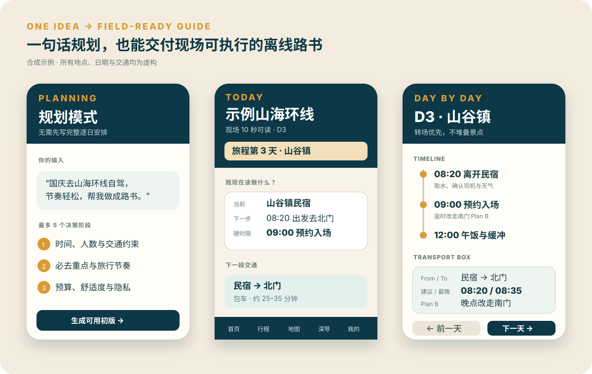

# Travel Guide PWA Builder / 旅行路书 PWA 构建技能

把一句旅行想法、已确认行程或现有路书，转成适合手机现场使用、可离线阅读、可按目的地换肤的旅行 PWA。支持低交互规划、固定行程执行、已有网站增量更新，以及通过 ChatGPT Sites 发布。

Turn a one-line trip idea, a booked itinerary, or an existing guide into a destination-themed, mobile-first travel PWA designed for real field use. It supports low-interaction planning, fixed-itinerary execution, full-release updates, offline public reading, and ChatGPT Sites publishing.

> 当前版本 / Current version: **2.2.0**



上图为合成、脱敏的中文 Demo，不含真实旅行者、航班、票据、访问码或部署信息。The image above is a synthetic, anonymized Chinese demo; it contains no real traveler, booking, access-code, or deployment data.

## 适用场景 / Use cases

| 模式 | 你可以怎么说 | Skill 做什么 |
|---|---|---|
| 规划 Planning | “今年十一去青甘环线自驾，帮我规划并做成路书。” | 不超过 5 个紧凑决策阶段，先核查会否推翻路线的关键事实，再交付可用初版。 |
| 执行 Execution | “机票和日期已定，按这些信息制作离线路书。” | 锁定已出票/已确认事实，补齐每天时间线、Transport Box、Hard Deadline 与 Plan B。 |
| 更新 Update | “酒店换了，10 月 3 日行程延后。” | 把新信息作为规范化数据的增量变更，但重新构建完整发布包并全局清理旧口径。 |

| Mode | Example input | What the skill does |
|---|---|---|
| Planning | “Plan a seven-day autumn road trip and make a guide.” | Uses at most five compact decision stages, verifies only plan-invalidating facts, then delivers a usable first draft. |
| Execution | “These flights and dates are fixed. Build the offline guide.” | Locks confirmed facts and adds timelines, executable transfers, hard deadlines, and failure branches. |
| Update | “The hotel changed and day 4 starts later.” | Applies the canonical delta, then rebuilds the complete release and removes retired data globally. |

无需提供参考样例，也无需先写完逐日行程。A reference design and completed day-by-day plan are optional.

## 交互输入 / Interaction input

规划模式最多覆盖以下五个决策阶段；已知内容会自动跳过：

1. 时间、时长、出发地、人数与交通约束；
2. 必去/不去、旅行节奏；
3. 预算、住宿与长途转场容忍度；
4. 行动能力、气候、证件、饮食或健康约束；
5. 本地交付或 Sites，以及是否开启个性化成员模式。

Planning mode covers at most five decision stages: trip frame, priorities, cost/comfort, operational constraints, and delivery/privacy. Known answers are skipped and safe defaults remain visible instead of blocking the first draft.

## 交付物 / Deliverables

- 手机优先的首页：当前阶段、下一步、下一段交通、真正的 Hard Deadline；
- 完整逐日时间线、具体 Transport Box、复杂转场分档 Plan B；
- 行程顺序地图、按城市/日期筛选、离线地点列表；
- 路线相关住宿区域、餐饮、装备、风险、预算与复核清单；
- PWA App Shell、离线缓存、安装图标、显式整包更新；
- 白底黑字的简化行程与分类 Checklist 打印；
- 可选的 Sites 公开阅读 + 私人票务/住宿/行李/成员同步；
- 脱敏审计、构建与发布检查、CHANGELOG 和剩余人工确认项。

Deliverables include a field-status home, day timelines, concrete transfer boxes, tiered Plan B logic, route-aware maps and filters, practical planning data, PWA/offline/update behavior, clean print views, optional Sites-backed member data, privacy audits, and a concise release handoff.

## 使用技巧 / Usage tips

- 把“已出票/不可改”与“候选/可调整”明确区分；Skill 不会静默改动硬事实。
- 票据截图只证明该条已订交通；未来时刻、签证、价格、天气仍需官方来源复核。
- 现场信息遵循 `Deadline → Transition → Failure mode`；百科内容默认折叠或省略。
- 个性化模式必须先决定公开/私人边界。姓名相同不是同一成员，显示名不能用于授权。
- “应用更新”更新整套页面和离线资源；“同步数据”只处理当前成员的授权记录。
- 地图、天气、实时票价和外部导航需要网络；核心公共路书不应依赖这些模块启动。

Tips: identify immutable bookings, keep dynamic facts sourced and dated, prioritize deadline/transfer/failure handling, treat identity as server authorization rather than a display name, and never conflate an application release with personal-data synchronization.

## 安装 / Install

```bash
git clone https://github.com/pengguin/travel-guide-pwa-builder.git \
  ~/.codex/skills/travel-guide-pwa-builder
```

随后直接描述需求，或显式调用 `$travel-guide-pwa-builder`。Then describe the trip or invoke `$travel-guide-pwa-builder` explicitly.

## 本地静态起步 / Local static starter

```bash
python3 scripts/create_project.py \
  --output /path/to/new-guide \
  --title "示例山海环线" \
  --short-title "山海环线" \
  --start-date 2030-10-01 \
  --end-date 2030-10-07 \
  --origin "出发城" \
  --destinations "海港城" "山谷镇" "古城" \
  --theme auto
```

此 starter 为无后端的公共静态 PWA：含日期状态、行程、示意路线、工具、打印与离线壳；不含登录、私人上传和云同步。The starter is a public, dependency-free PWA and intentionally does not implement authentication, uploads, or cloud sync.

## 环境依赖 / Environment

- Python 3.10+：运行初始化与静态审计脚本；
- 现代浏览器：预览 Service Worker、离线与 PWA 行为；
- Git：仅仓库工作流需要；
- Sites 项目：遵循项目当前 `package.json`、锁文件、`.openai/hosting.json` 与官方 Sites skills，不在本仓库固定 Node/vinext/Worker 版本；
- 网络：官方信息核查、依赖安装、地图/天气/实时数据、Sites 登录与发布、首次私人数据下载/同步需要网络。

Local starter generation and static tests can run offline. Hosted builds must use the runtime declared by the current official Sites scaffold and existing project lockfile.

### 没有 ChatGPT Sites 时 / Without ChatGPT Sites

Skill 仍可交付本地/便携公共 PWA。等价的公开、多用户方案在概念上需要静态托管、HTTPS、服务端函数、身份、数据库/对象存储和严格的缓存边界；**本 Skill 暂不实现或提供该替代部署方案**。

The skill can still deliver the local public PWA. A provider-neutral multi-user substitute would require static hosting, HTTPS, server functions, identity, durable storage, and PWA cache isolation; **this repository does not implement that alternative**.

## 验证 / Validation

```bash
python3 -m unittest discover -s tests -v
node --test tests/*.test.cjs
python3 scripts/audit_travel_guide.py /path/to/guide --release
```

静态构建不等于真机验收。iPhone 主屏幕冷启动、飞行模式、键盘缩放、地图 App 深链和已部署账号隔离必须在对应设备/域名上单独验证。A passing build is not proof of physical iPhone, deployed authentication, or real offline behavior.

## 隐私 / Privacy

本仓库不包含真实行程、机票/火车票、订单截图、旅行者、访问码、私人设备路径、数据库、部署 ID 或凭据。复用真实路书时只抽取行为和数据契约，不能复制生产数据或个人截图。

This repository contains no real traveler, booking, ticket image, access code, private path, database, deployment ID, or credential. Real projects contribute reusable contracts only—not production data.

## 免责声明 / Disclaimer

生成内容用于旅行规划与信息整理，不保证航班、铁路、价格、签证/入境、登记、天气、道路、营业时间、保险权益或安全条件持续有效。出行前及现场请以政府、承运人、酒店和服务商的最新官方通知为准。本项目不构成法律、移民、医疗、安全或财务建议；使用者对证件、资格、预订、保险、当地规则及个人安全承担最终责任。详见 [DISCLAIMER.md](DISCLAIMER.md)。

Generated content is planning assistance, not a guarantee of transport, pricing, immigration, weather, road, opening-hour, insurance, or safety conditions. Verify consequential facts with the responsible authority or operator. See [DISCLAIMER.md](DISCLAIMER.md).

## 版权与许可 / Copyright and license

Copyright © 2026 pengguin. Code and documentation are released under the [MIT License](LICENSE). Third-party assets, sources and trademarks retain their respective rights and require separate attribution or permission.
